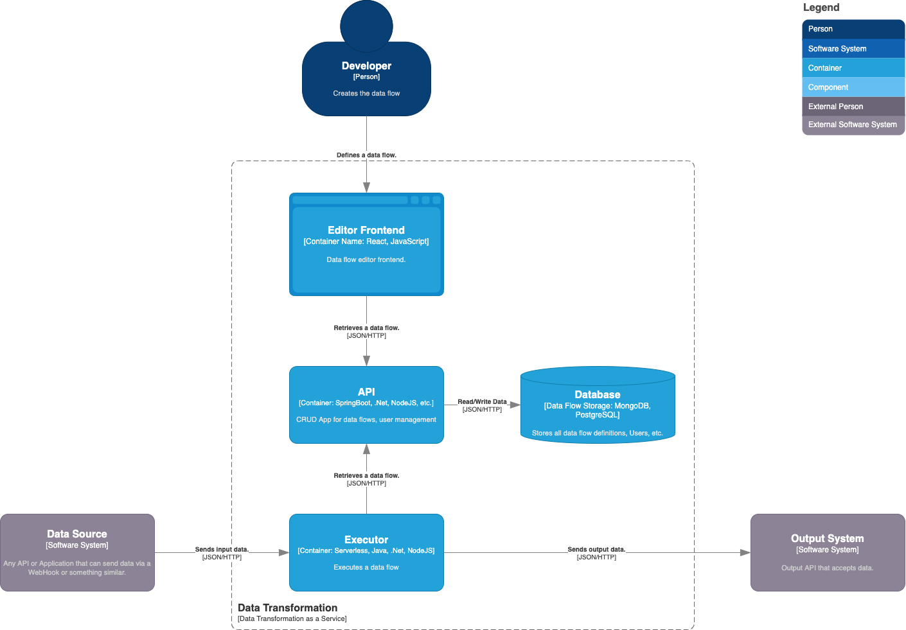
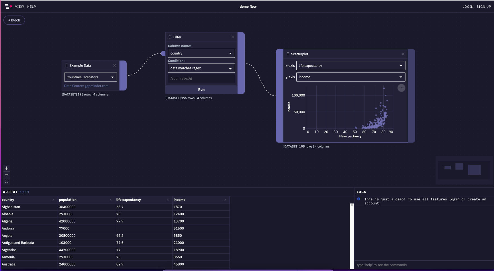

# Idea - Data Transformation as a Service

## Problem

Imagine you want to track closed GitHub issues in a Google Sheets document. For this you would need to create an application that listens to a WebHook from GitHub and then picks the important information and writes it via the Google  API into a Google Sheets document.

## Solution

An application that allows a user to create a data flow from an incoming request or a plain JSON file or some other input source. This data flow then picks the fields you want to select and transforms it into a new JSON that is sent to some predefined APIs (Google Sheets, etc.). 

It's a combination of [IFTTT](https://ifttt.com/) and  [Node-RED](https://nodered.org/). A node based editor that describes a data flow for a given automation.

## Use-Cases

You want  a simple website for people to register to you party or event. The registrations should be stored in a Google Sheets document.

You just built a web application, every time an exception of a specific type occurs you want to create an Issue in GitHub.

## How it works

A user can define a data flow from an input source and send it to an output source. In between input and output the data can be adjusted with a transformation.

### Possible input APIs

Data can be received from:

- GitHub
- Custom WebHook
- Discord / Slack / Teams
- Files

### Possible Transformations

- Filter
- Merge
- Group
- Slice
- Sort
- Rename

### Possible output APIs to connect to

Data can be sent to:

- Google Sheets
- Google Calendar
- Home Automation
- Mail
- Discord / Slack / Teams
- Files

## System Overview

The system will consists of two application. One to define the monitor, called the Editor, and another one that can execute the defined flow.

### Editor

The editor helps to define a data flow for a user it stores all definitions and provides an endpoint for the Executor application to retrieve the defined data flows.

It could be build using the following stack:

- **Frontend**
  - JavaScript / React
    - [React Flow](https://reactflow.dev/)
- **Backend (CRUD)**
  - Java
  - C#
- **Database**
  - MongoDB => If data flows are stored as a JSON file
  - PostgreSQL
- **Hosting**
  - DigitalOcean
  - AWS

### Executor

This application handles the incoming data, the transformations, and the passing to the output. It is the main part of the data transformation because it handles all the data processing.

It could be build using the following stack:

- **Backend**
  - C#
  - Java
  - NodeJS
  - Python
- **Hosting**
  - [CloudFlare Workers](https://workers.cloudflare.com/) => Only For [these languages](https://developers.cloudflare.com/workers/platform/languages) but it has 0ms startup time.
  - DigitalOcean
  - AWS

## Container

The following container exists in this project.

## Organisation

### Tools

- Code
  - [GitHub](https://github.com/)
    - Public Organization to receive all features & unlimited action minutes
    - Code is stored in a Monorepo (both applications)
  - [VSCode](https://code.visualstudio.com/)
  - [IntelliJ](https://www.jetbrains.com/de-de/idea/)
  - Whatever...
- API & Testing 
  - [Postman](https://www.postman.com/)
  - [Swagger](https://swagger.io/tools/)
- Telemetry
  - [Sentry](https://sentry.io/welcome/)
  - [New Relic](https://newrelic.com/)
- Messages
  - [RabbitMQ](https://www.rabbitmq.com/)
  - [Apache Kafka](https://kafka.apache.org/)
- Storage
  - [PostgreSQL](https://www.postgresql.org/)
  - [MongoDB](https://www.mongodb.com/)
- Deployment
  - [Cloudflare Worker](https://workers.cloudflare.com/)
  - [DigitalOcean](https://www.digitalocean.com/)
  - [AWS Lambda](https://aws.amazon.com/lambda/)
  - [Azure Functions](https://azure.microsoft.com/services/functions/)

- A new **public** organization will be created on [GitHub](https://github.com/)
- Code is stored in a Monorepo (both applications) within the created organization.
- The deployment is automated using GitHub Actions
- For the API

## Additional Information

The editor for the data flows (transformations) could look like this:

